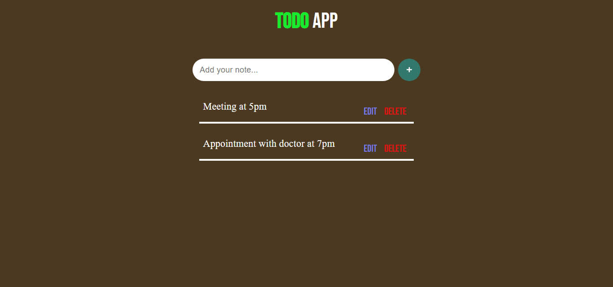

# A Basic Todo App built purely in JavaScript

A basic Todo App implementation in Vanilla JavaScript with UI made with HTML and CSS.

Best project for performing CRUD operations in JS without the help of any frameworks.

Here is how the project looks:
